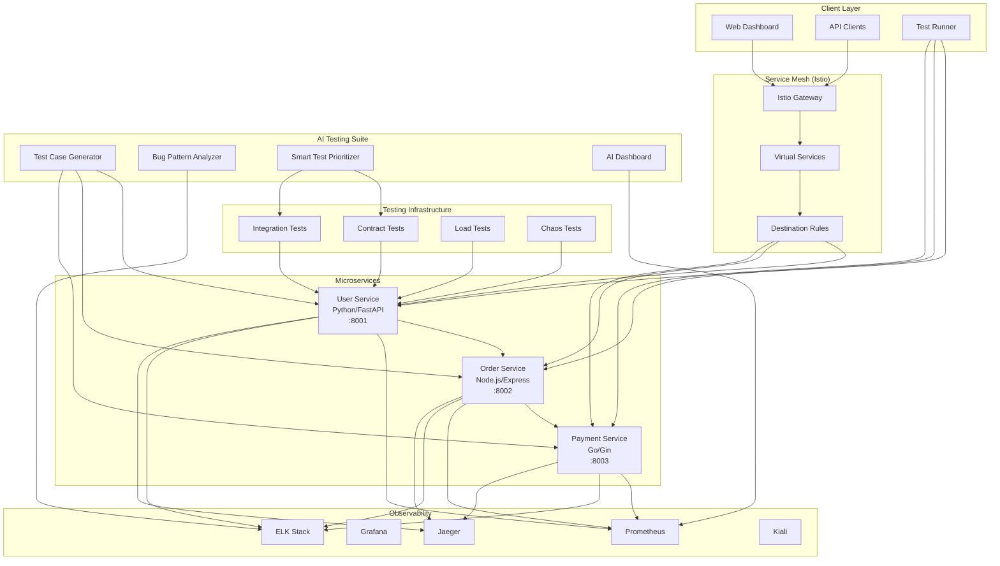
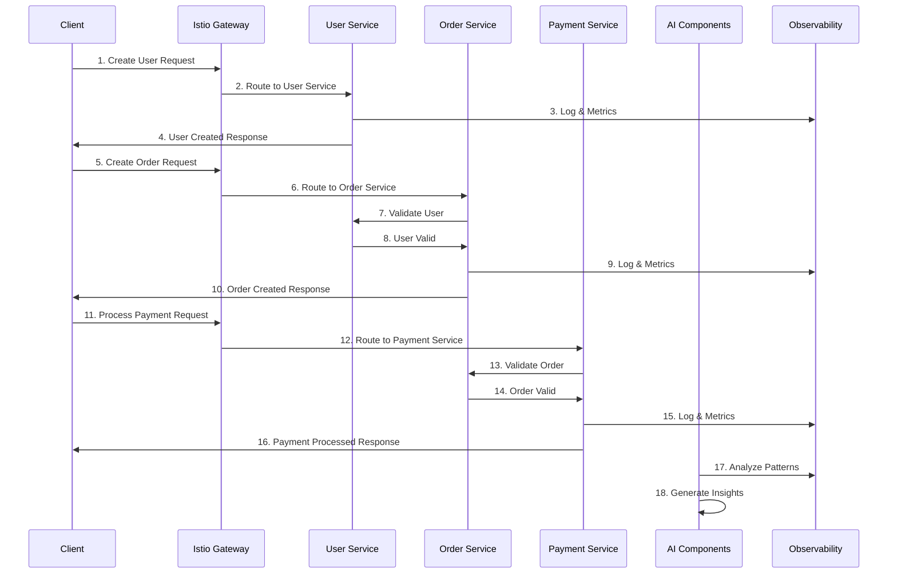
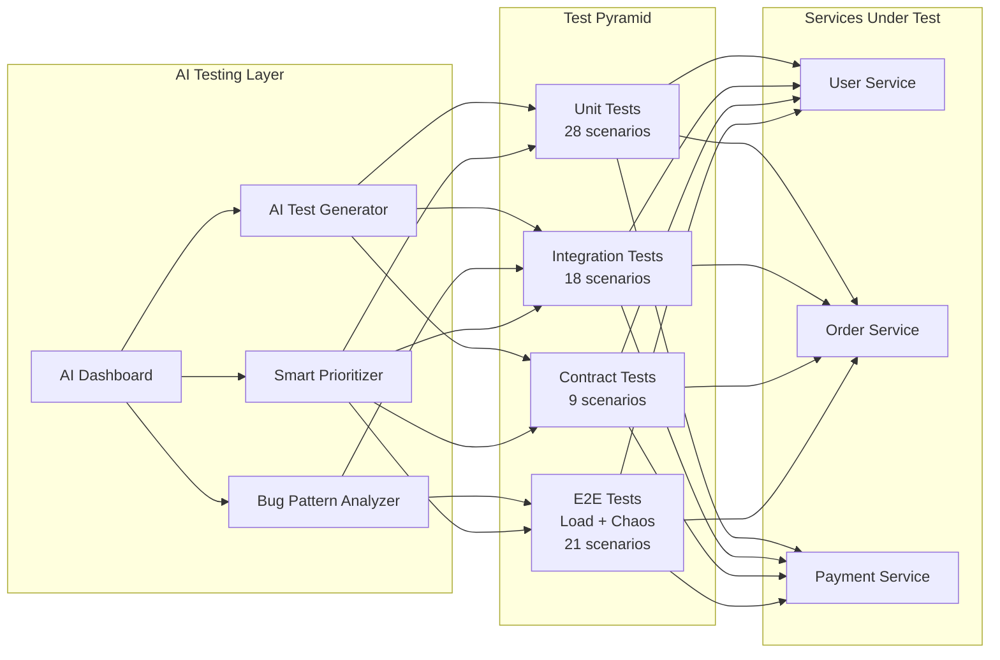
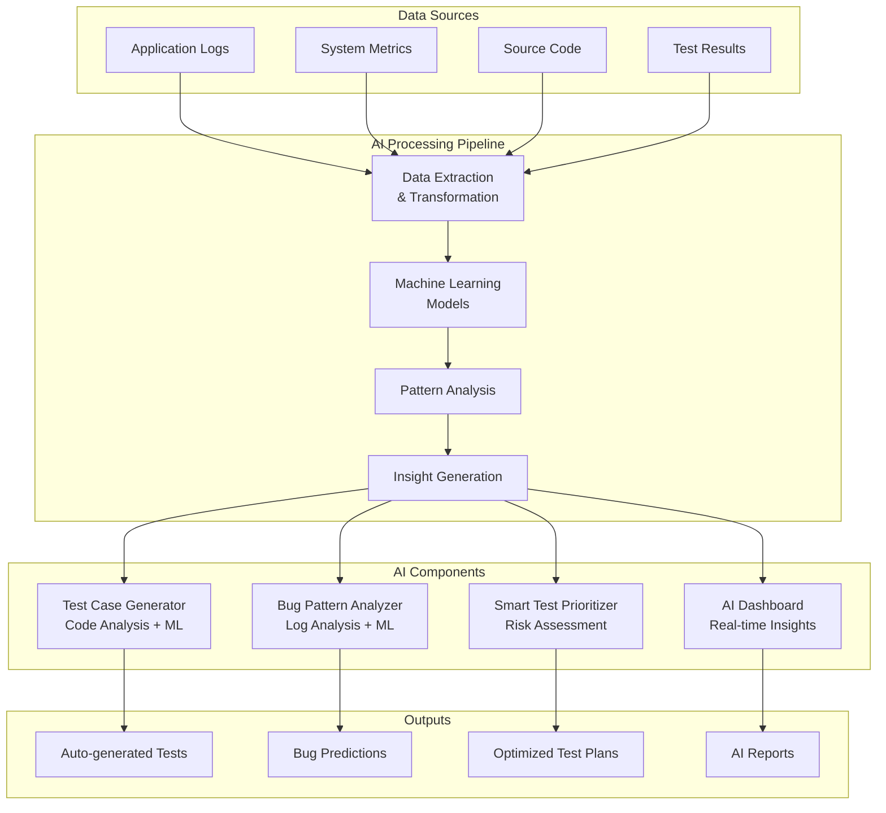
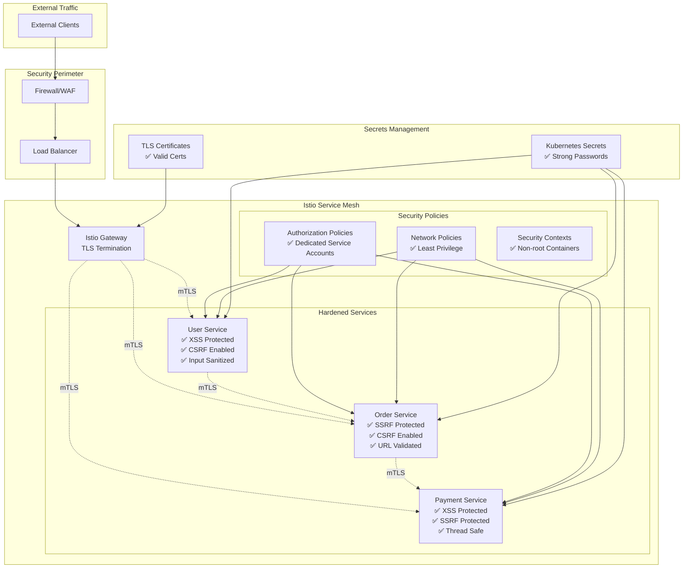
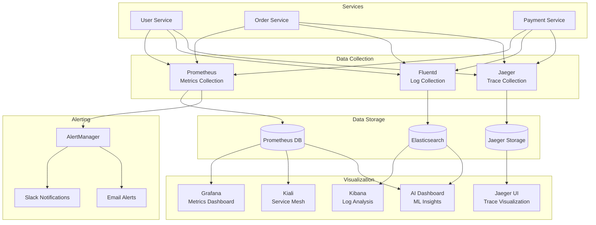
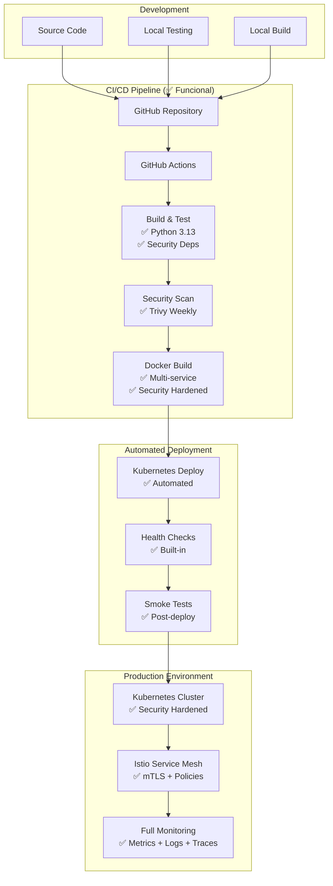

# 🏗️ Arquitetura do Sistema - AI-Powered Microservices Testing Suite

## 📐 **Visão Geral da Arquitetura**

---

## 🔄 **Fluxo de Dados End-to-End**

---

## 🧪 **Arquitetura de Testes**

---

## 🤖 **Arquitetura de IA**

---

## 🔒 **Arquitetura de Segurança (Hardened)**

---

## 📊 **Arquitetura de Observabilidade**

---

## 🚀 **Arquitetura de Deployment (100% Funcional)**

---

## 📋 **Componentes e Tecnologias**

### **Microserviços:**
- **User Service**: Python 3.13 + FastAPI + Pydantic
- **Order Service**: Node.js 18 + Express + UUID
- **Payment Service**: Go 1.21 + Gin + UUID

### **Service Mesh:**
- **Istio 1.19+**: Gateway, VirtualService, DestinationRule
- **mTLS**: Mutual TLS entre todos os serviços
- **Policies**: Authorization + Network + Security

### **Testing:**
- **Pytest 8.3.3**: Framework principal de testes
- **Pactman 2.31.0**: Contract testing (consumer-driven)
- **Locust 2.17.0**: Load testing e performance
- **Docker 6.1.3**: Chaos engineering

### **AI/ML:**
- **Scikit-learn**: Machine learning models
- **Pandas**: Data analysis e processing
- **Flask 3.0.3**: AI dashboard web interface
- **Custom Algorithms**: Pattern recognition

### **Observabilidade:**
- **Prometheus**: Metrics collection
- **Grafana**: Metrics visualization
- **ELK Stack**: Centralized logging
- **Jaeger**: Distributed tracing
- **Kiali**: Service mesh observability

### **Infrastructure:**
- **Kubernetes 1.28+**: Container orchestration
- **Docker**: Containerization + Security hardened
- **GitHub Actions**: CI/CD pipeline (100% funcional)
- **Helm**: Package management
- **Container Registry**: Multi-service images

---

## 🎯 **Padrões Arquiteturais Implementados**

### **Microservices Patterns:**
- ✅ **Database per Service**
- ✅ **API Gateway** (Istio Gateway)
- ✅ **Service Discovery** (Kubernetes DNS)
- ✅ **Circuit Breaker** (Istio DestinationRule)
- ✅ **Bulkhead** (Resource isolation)

### **Design Patterns (Essenciais):**
- ✅ **Singleton** (HTTP client pooling)
- ✅ **Builder** (Service configuration)
- ✅ **Decorator** (Logging & retry logic)
- ❌ **Repository** (Over-engineering para in-memory)
- ❌ **Factory** (Objetos simples não justificam)
- ❌ **Strategy** (Validação simples sem alternativas)

### **Testing Patterns:**
- ✅ **Test Pyramid** (Unit → Integration → E2E)
- ✅ **Consumer-Driven Contracts** (Pact)
- ✅ **Chaos Engineering** (Resilience testing)
- ✅ **Shift-Left Testing** (Early validation)
- ✅ **AI-Powered Testing** (ML-driven test generation)

### **Observability Patterns:**
- ✅ **Three Pillars** (Metrics + Logs + Traces)
- ✅ **Correlation IDs** (Request tracking)
- ✅ **Health Checks** (Liveness + Readiness)
- ✅ **SLI/SLO** (Service level objectives)
- ✅ **Dead Letter Queue** (Failed log handling)

### **Security Patterns:**
- ✅ **Zero Trust** (mTLS everywhere)
- ✅ **Defense in Depth** (Multiple layers)
- ✅ **Least Privilege** (Minimal permissions)
- ✅ **Secrets Management** (Strong credentials)
- ✅ **Input Sanitization** (XSS/SSRF prevention)
- ✅ **CSRF Protection** (Token-based)
- ✅ **Path Validation** (Traversal prevention)
- ✅ **Container Hardening** (Non-root execution)

---

## 🛡️ **Security Hardening Status**

### **✅ Vulnerabilidades Corrigidas:**
- **XSS Prevention**: Input sanitization implementada
- **SSRF Protection**: URL validation com allowlist
- **CSRF Protection**: Token-based protection habilitado
- **Log Injection**: Message sanitization e data masking
- **Path Traversal**: Safe path joining implementado
- **Command Injection**: Subprocess security implementado
- **Memory Leaks**: TTL cache para tokens CSRF
- **Container Security**: Non-root execution contexts

### **🔧 Error Handling Robusto:**
- **HTTP Requests**: Timeout e exception handling
- **Concurrent Operations**: Thread safety implementado
- **Service Communication**: Retry logic com fallback
- **Test Reliability**: Graceful degradation

---

**📅 Criado em:** 25/09/2024  
**📅 Atualizado em:** 26/12/2024  
**👨💻 Arquiteto:** Lucas Teixeira  
**🎯 Versão:** 3.0 - Full Production Ready with CI/CD  
**📊 Status:** 100% Implementado  
**🔒 Security:** All Critical Vulnerabilities Fixed  
**🏗️ Architecture:** Essential Patterns Implemented  
**🚀 CI/CD:** 100% Functional with Automated Deploy  
**📦 Containers:** Security Hardened with Health Checks