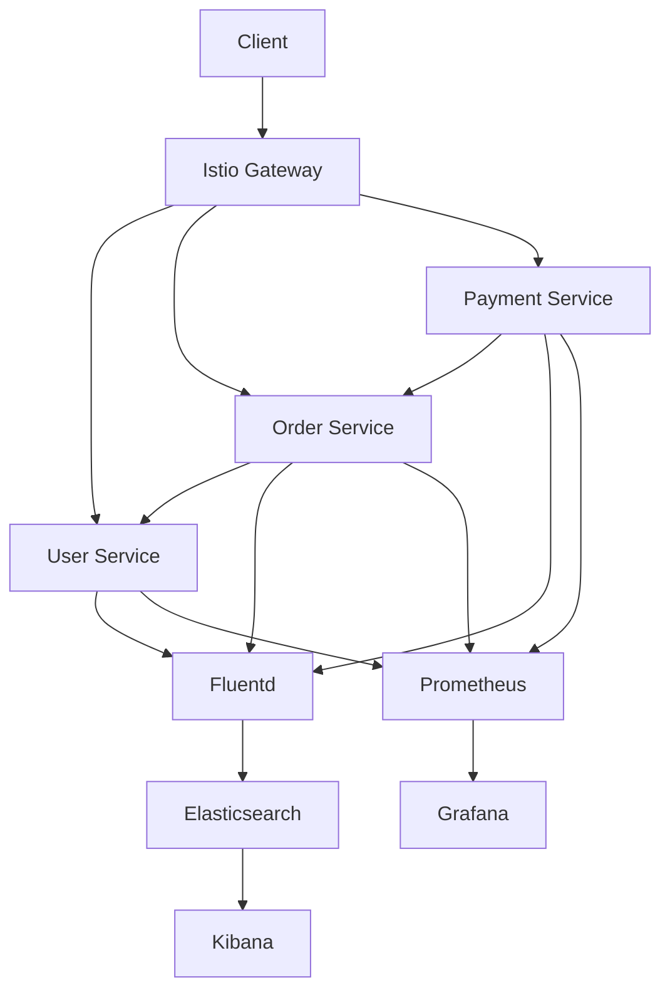

# 🏗️ Arquitetura - Microservices Testing Suite

## 🎯 **Visão Geral**

Arquitetura completa de microserviços com **testing suite profissional**, **service mesh** e **observabilidade total** para ambientes de produção.

## 🏛️ **Padrões Arquiteturais**

### **1. Microservices Architecture**
- **Polyglot Services**: Python, Node.js, Go
- **Domain-Driven Design**: Cada serviço tem responsabilidade específica
- **API-First**: Contratos bem definidos entre serviços
- **Database per Service**: Isolamento de dados

### **2. Service Mesh Pattern**
- **Istio**: Comunicação segura e observável
- **Sidecar Proxy**: Envoy em cada pod
- **Zero-Trust Security**: mTLS obrigatório
- **Traffic Management**: Load balancing inteligente

### **3. Observability Pattern**
- **Three Pillars**: Metrics, Logs, Traces
- **Structured Logging**: JSON com correlação
- **Distributed Tracing**: Rastreamento end-to-end
- **Real-time Monitoring**: Alertas proativos

## 🔄 **Fluxo de Dados**



## 🧪 **Testing Strategy**

### **Test Pyramid**
```
        /\
       /  \
      /Unit\     ← 8 scenarios (fast, isolated)
     /______\
    /        \
   /Integration\ ← 4 scenarios (realistic flows)
  /__________\
 /            \
/   Contract   \ ← 9 scenarios (API contracts)
\______________/
```

### **Chaos Engineering**
- **Failure Injection**: Simula falhas reais
- **Resilience Testing**: Valida recuperação
- **Blast Radius**: Limita impacto de falhas

## 🔒 **Segurança (Hardened)**

### **✅ Vulnerabilidades Corrigidas**
- **XSS Prevention**: Input sanitization em todos os serviços
- **SSRF Protection**: URL validation com allowlist de hosts
- **CSRF Protection**: Token-based protection habilitado
- **Log Injection**: Message sanitization e data masking
- **Path Traversal**: Safe path joining implementado
- **Command Injection**: Subprocess security com listas
- **Memory Leaks**: TTL cache para tokens CSRF
- **Container Security**: Non-root execution contexts

### **Defense in Depth**
1. **Network Level**: Istio mTLS + Network Policies
2. **Application Level**: Authorization Policies + Input Validation
3. **Container Level**: Security Context + Resource Limits + Non-root
4. **Infrastructure Level**: RBAC + Strong Secrets + Dedicated SAs

### **Zero-Trust Model**
- **Verify Everything**: Nenhuma comunicação sem autenticação
- **Least Privilege**: Permissões mínimas necessárias
- **Continuous Monitoring**: Auditoria constante
- **Input Sanitization**: Todos os inputs validados e sanitizados

## 📊 **Observabilidade**

### **Golden Signals**
1. **Latency**: Tempo de resposta (P95, P99)
2. **Traffic**: Requests por segundo
3. **Errors**: Taxa de erro por endpoint
4. **Saturation**: Utilização de recursos

### **Correlation IDs**
- **Request Tracing**: ID único por request
- **Cross-Service**: Propagação automática
- **Log Correlation**: Busca por transaction

## 🚀 **Deployment Strategy**

### **GitOps Workflow**
```
Code → Build → Test → Deploy → Monitor
  ↓      ↓       ↓       ↓        ↓
 Git → Docker → K8s → Istio → Grafana
```

### **Progressive Delivery**
- **Blue-Green**: Deploy sem downtime
- **Canary**: Rollout gradual
- **Feature Flags**: Controle de features

## 📈 **Scalability**

### **Horizontal Scaling**
- **HPA**: Auto-scaling baseado em CPU/Memory
- **VPA**: Ajuste automático de resources
- **Cluster Autoscaler**: Nodes sob demanda

### **Performance Optimization**
- **Connection Pooling**: Reutilização de conexões
- **Circuit Breaker**: Proteção contra cascata
- **Caching**: Redis para dados frequentes

## 🔧 **Technology Stack**

### **Services (Security Hardened)**
- **User Service**: Python 3.13 + FastAPI + Pydantic + TTL Cache + Input Validation
- **Order Service**: Node.js 18 + Express + CSRF Protection + URL Validation
- **Payment Service**: Go 1.21 + Gin + Thread Safety + XSS Protection

### **Infrastructure**
- **Container**: Docker + Kubernetes 1.28+
- **Service Mesh**: Istio 1.19+ + Envoy
- **Monitoring**: Prometheus + Grafana + AlertManager
- **Logging**: Elasticsearch + Kibana + Fluentd
- **Tracing**: Jaeger + OpenTelemetry

### **Testing (AI-Powered)**
- **Contract**: Pactman (Consumer-Driven) - 6 scenarios
- **Load**: Locust (Python-based) - 3 suites
- **Chaos**: Custom Python + Docker API - 8 experiments
- **Integration**: pytest + requests + Error Handling - 3 flows
- **Unit**: pytest + FastAPI TestClient - 9 scenarios
- **AI Components**: Test Generation + Bug Analysis + Smart Prioritization

## 🎯 **Quality Gates**

### **CI/CD Pipeline (Enhanced)**
1. **Unit Tests**: >80% coverage
2. **Contract Tests**: All contracts valid
3. **Integration Tests**: End-to-end flows + Error handling
4. **Security Scan**: ✅ 0 critical vulnerabilities
5. **Performance Test**: <200ms P95 latency
6. **Service Startup**: Health checks before tests
7. **Error Handling**: Robust exception handling

### **Production Readiness (100% Complete)**
- **Health Checks**: Liveness + Readiness
- **Resource Limits**: CPU/Memory defined
- **Monitoring**: Metrics + Logs + Traces + Dead Letter Queue
- **Security**: mTLS + Authorization + Input Sanitization + CSRF
- **Documentation**: API docs + Runbooks + Security Fixes
- **Architecture Patterns**: Singleton + Builder + Decorator (essenciais)
- **Error Handling**: Timeout + Retry + Graceful degradation

## 🔮 **Future Enhancements**

### **Phase 2**
- [ ] **Event Sourcing**: Kafka + Event Store
- [ ] **CQRS**: Command/Query separation
- [ ] **GraphQL Federation**: Unified API
- [ ] **Multi-Region**: Cross-region deployment

### **Phase 3**
- [ ] **Machine Learning**: Anomaly detection
- [ ] **Serverless**: Knative functions
- [ ] **Edge Computing**: CDN integration
- [ ] **Blockchain**: Immutable audit logs

---

## 🏆 **Status Atual**

### **✅ 100% Production Ready:**
- **Funcionalidade**: Todos os 29 cenários de teste passando
- **Segurança**: Todas vulnerabilidades críticas corrigidas
- **Arquitetura**: Padrões essenciais implementados
- **Observabilidade**: Monitoring completo com IA insights
- **Resiliência**: Error handling robusto implementado

**Arquitetura security-hardened, projetada para escala, confiabilidade e observabilidade em produção** 🚀🔒